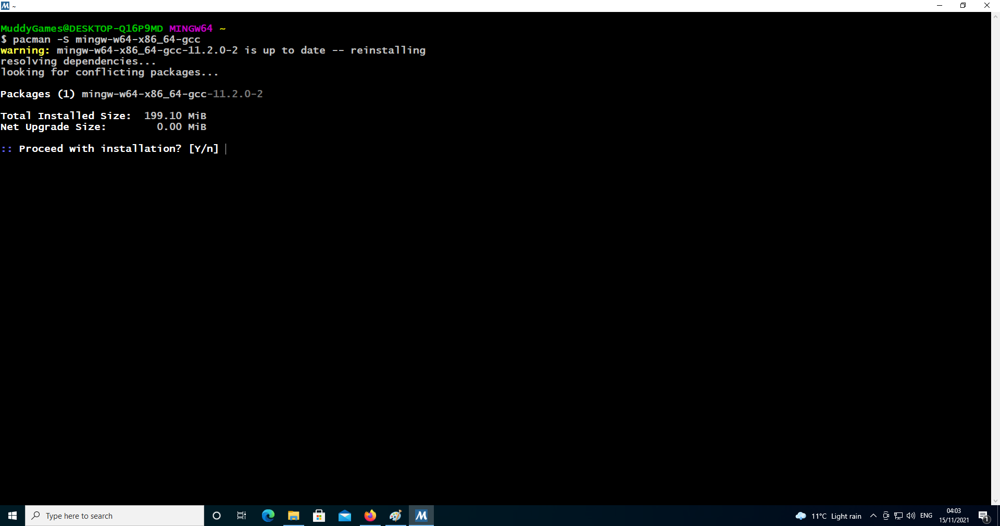
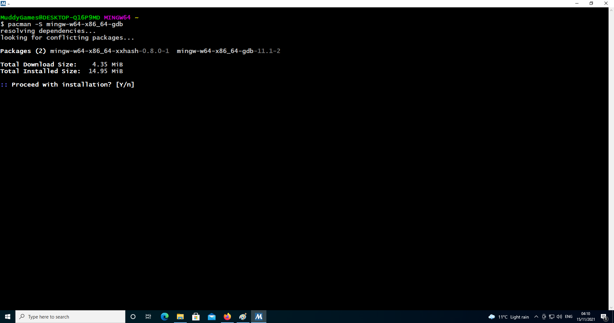
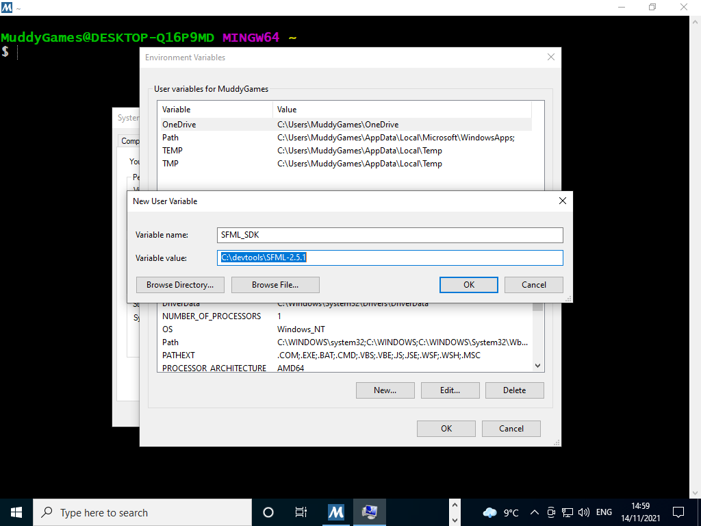

# README #
This project is SFML FSM StarterKit, this works on Linux
For windows the includes, libraries and paths will need to be set manually
SFML is not supported on Cgwin or MSys2 on Windows so it requires a custom install.
  
## Installation Linux
* Download Repository to your Project Workspace
* Install **SFML** on **debian** based distro using `sudo apt-get install libsfml-dev`
* Navigate to root of project
* type `make`

## Installation Windows
* Download and install [MSYS64](https://www.msys2.org/)  

* Open MSYS Bash
	* **STEP 1** of Updating msys `pacman -Syu` this will shutdown bash when complete.  
	
	* **STEP 2** of Updating msys after this has complete restart MSYS Bash and run `pacman -Su`  
	
	* **STEP 3** (Note this there are multiple commands below, to get toolchain up and running) Open MSYS Bash and install
>   * **STEP 3.1** **gcc** `pacman -S gcc`  

>   * **STEP 3.2** **mingw gcc** `pacman -S mingw-w64-x86_64-gcc`  

>   * **STEP 3.3** **mingw gdb** `pacman -S mingw-w64-x86_64-gdb`  

>   * **STEP 3.4** **make** `pacman -S make`  

>   * **STEP 3.5** **git** `pacman -S git`  

>   * **STEP 3.6** **SFML** `pacman -S mingw-w64-x86_64-sfml`see [MSYS Website Packages](https://packages.msys2.org/package/mingw-w64-x86_64-sfml).  
 

* **STEP 4** Download GCC 7.3.0 MinGW (SEH) - 64-bit from [SFML Website](https://www.sfml-dev.org/download/sfml/2.5.1/) 

>  * Its good practice to place in `c:\devtools\SFML`  

>   * Before proceeding to next step ensure your directory structure looks like image below  

* **STEP 5** Setup a Windows Environment Variable which points to where `GCC 7.3.0 MinGW (SEH) - 64-bit` is located, also set the location of DLLs in Windows Path.

>   * Restart MSYS64 Bash and check that enviroment variable exists by typing `echo {SFML_SDK}` in terminal. Also check that you can see includes, libs and DLLs  

* **STEP 6** Create a directory e.g. `Projects` for repository, then `cd c:/Projects' and Clone repository  

* **STEP 7** Ensure Windows SDK is installed, SFML depends on OpenGL libs. Windows SDK can be downloaded from [Microsoft Developer Website](https://developer.microsoft.com/en-us/windows/downloads/sdk-archive/) . Tested with version 19041.0.  

* **STEP 8** Navigate to cloned project folder `sfml_game`
>   * Type `make` in MSYS Bash Terminal  

## What is this repository for? ##
* Getting started with Visual Studio Code, SFML, Makefiles and Finite State Machines on Linux and Windows (Note Makefile will work on both as long as toolchain is setup correctly)
* This is a great Tutorial to get this project running on [Windows](https://www.youtube.com/watch?v=Ljhpsdz8Ouo)

## Art Assets ##
* This starter kit contains numerous art assets including Walking, Jumping and attacks

## Who do I talk to? ##
* philip.bourke@itcarlow.ie